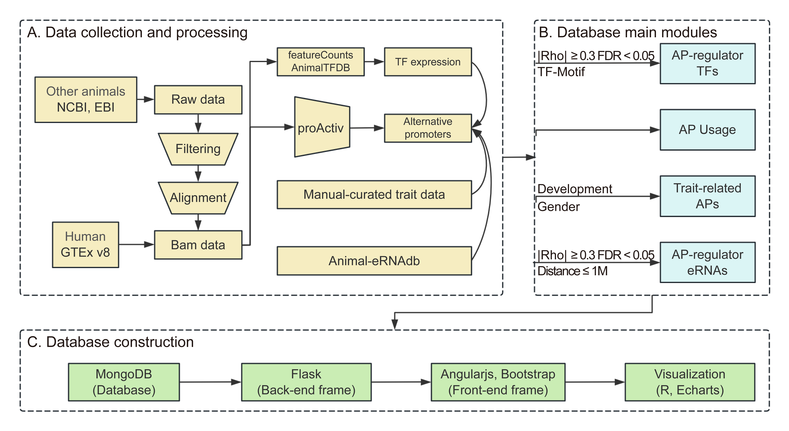

# Animal-APdb
**Alternative promoters** event, as a major pre-transcriptional mechanism, 
can initiate different transcription start sites (TSSs) to generate distinct mRNA isoforms and regulate their expression. Increasing evidence shows that alternative promoter event is associated with complex traits, characteristics, and diseases.
At present, hundreds of thousands of alternative promoters have been identified across human tissues. 
However, alternative promoter profiles in animals have not been fully recognized. To reveal the landscape of alternative promoter usage and associated factors, 
we constructed the <strong><font color="#f66b0e">Animal</font> <font color="#f66b0e">A</font>lternative <font color="#f66b0e">P</font>romoter <font color="#f66b0e">D</font>ata<font color="#f66b0e">b</font>ase </strong> <strong> <font color="#f66b0e"> (Animal-APdb)  </font>  </strong>  using RNA-seq data from 6,514 samples of 11 species, 
including chicken, cow, dog, fruitfly, frog, mouse, pig, rat, rhesus, worm and zebrafish.   
**In In [Animal-APdb](http://gong_lab.hzau.edu.cn/Animal_AP#!/), users can:**  
✔️  Query the **alternative promoter** usage by selecting species, tissue, and input gene names interested.  
✔️  Browse **traits-related** alternative promoters that are associated with developmental stage, gender in each tissue of each species.  
✔️  Search **eRNAs** that may regulate alternative promoter events in each tissue of each species.  
✔️  Search **transcription factors** that may regulate alternative promoter events in each tissue of each species.  
✔️ **Download** alternative promoter information across different tissues of each species.
## Animal-APdb workflow


  
### RNA-seq data processing
- Quality control: FastQC (version: v.0.11.8)  
```
fastqc [-o output dir] [-f fastq|bam|sam][-t threads] seqfile1 .. seqfileN
```

- Cleaning: Trim Galore (version: 0.6.4_dev)
```
trim_galore -q 25 -e 0.1 --phred33 --length 36 --stringency 3 seqfile1_1 seqfile1_2
```
- Alignment: HISAT2
```
hisat2 -p 30 -x indexfile -1 seqfile1_1 -2 seqfile1_2 
```
### Identify Alternative Promoters with proActiv
[*proActiv*](https://goekelab.github.io/proActiv/) was used in identifying and quantifying alternative promoters.
``` 
identify_AP.R
```
### Identify trait-related APs
```R
identify traitRelated_AP.R
```
### Identify AP-regulator eRNA
```R
identify_eRNA.R
```
### Identify AP-regulator TF
```R
identify_TF.R
```
